```{r setup, include=FALSE}
knitr::opts_chunk$set(echo = FALSE, eval = TRUE)
```
```{r render, eval=FALSE}
library(xaringan)
rmarkdown::render("microbiome-profiling.Rmd")
```


## Acknowledgements

Reviewers:

- Wenjin Gu
- Kevin Tracy

Instructors:

- Dr. Armand Bankhead
- Dr. Josh Welch

---

## Outline

- Background
- Techniques in microbial community profiling
- Discussion
- My Conclusions

---

### Background

**Microbiome**: The collection of microbes that live in an environment.

.center[
```{r, out.width= '90%'}
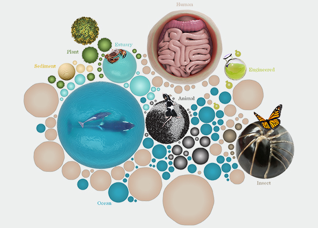
```
]

.footnote[
[[EMBL-EBI: What's a microbiome?](https://www.ebi.ac.uk/about/news/feature-story/whats-a-microbiome)]
]

---

### Background: Why care?

.center[
Changes in the composition of the human microbiome are associated with health and disease.
```{r, out.width= '85%'}
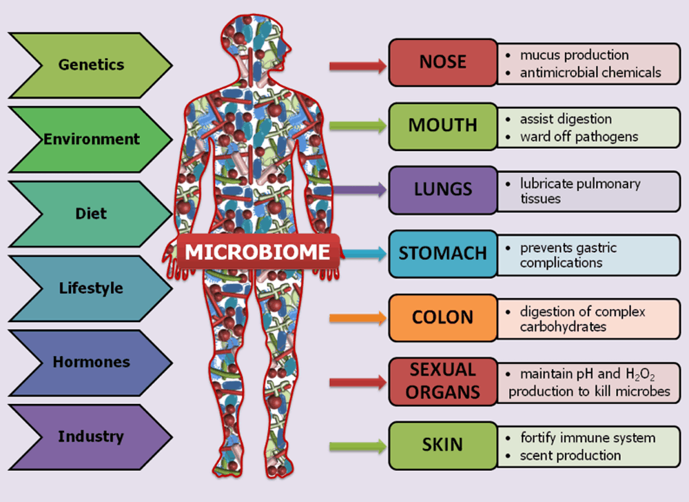
```
]

.footnote[
[[The Human Microbiome Project, Nature 2012](https://dx.doi.org/10.1038%2Fnature11234)]   [[theconversation.com/the-human-microbiome](http://theconversation.com/the-human-microbiome-is-a-treasure-trove-waiting-to-be-unlocked-118757)]
]

---
### Background
- **Microbial community profiling**: Characterize which microbes are present and how abundant they are.

---
### Background
- **Microbial community profiling**: Characterize which microbes are present and how abundant they are.

- Application: detecting colorectal cancer (CRC)
  - Colonoscopy is invasive, but the best way to detect CRC.
  - Profiled microbiota from fecal samples of cancer patients and healthy individuals.
  - Classified individuals as healthy vs cancer based on microbial DNA, compared to colonoscopy results as ground truth.
  - Microbial community profiling improved classifications over other less-invasive methods.

.center[  
👤👤👤 ➡️ 💩💩💩 ➡️ 🦠🦠🦠 ️➡️ 🧬🧬🧬 ➡️ 💻 ➡️  📊
]

.footnote[
[Baxter et al., Genome Med. 2016](https://genomemedicine.biomedcentral.com/articles/10.1186/s13073-016-0290-3)
]

---

### Background: Phylogeny & Taxonomy

.center[
**Phylogeny**: building evolutionary trees.

```{r, out.width='100%'}
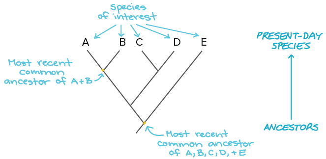
```
]

.footnote[
[[khanacademy.org: evolutionary trees](https://www.khanacademy.org/science/biology/her/tree-of-life/a/building-an-evolutionary-tree)]
]

---
### Background: Phylogeny & Taxonomy

.center[
**Taxonomy**: classifying organisms, informed by phylogeny.

```{r, out.width="80%"}
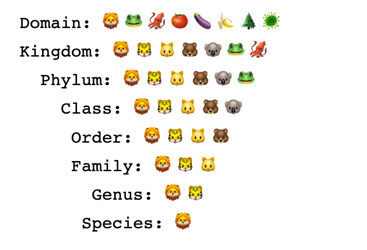
```
]

.footnote[
[[twitter.com/biolojical](https://twitter.com/biolojical/status/1142920063999025152)]
]

---
### Background: Phylogeny & Taxonomy

Challenges for classifying prokaryotes:
- Asexual reproduction
- Fast evolutionary change
- Horizontal gene transfer

.center[
```{r, out.width="80%"}
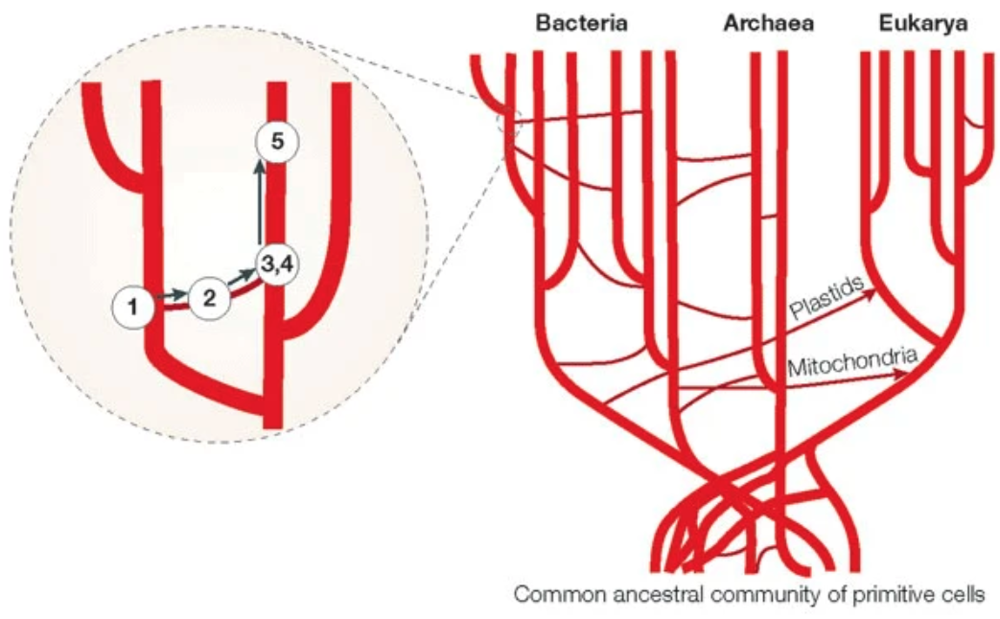
```
]

.footnote[
[[Smets & Barkay, Nature Reviews 2005](https://doi.org/10.1038/nrmicro1253)]
]

---

### Background: Operational Taxonomic Unit (OTU)

- Proxy for microbial species (or any desired taxonomic level).
- Created by clustering sequences based on sequence similarity.
- Avoids difficulties of classifying bacteria into species, especially when unknown organisms are present.

```{r, out.width='100%'}
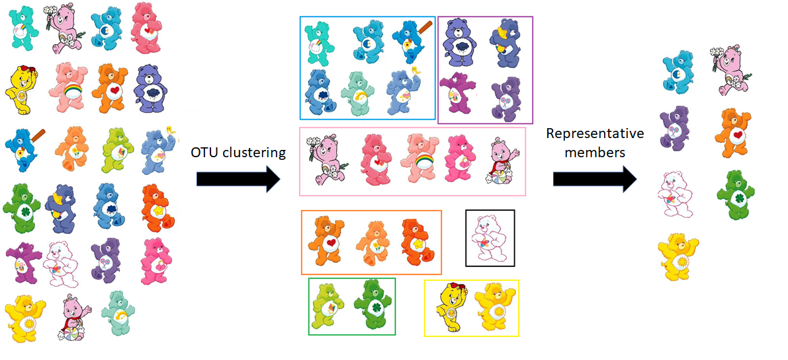
```

---

### Background: Key Questions Raised

- Is there a core set of microbial species or genes that all humans share?

- How do changes in microbial abundances at particular taxonomic levels relate to health & disease?

---

## Outline

- Background
- **Techniques in microbial community profiling**
  - Overall Workflow
  - Sequencing
  - Clustering
  - Comparing Communities
- Discussion
- My Conclusions

---

## Techniques: Overall Workflow

.center[
```{r, out.width='100%'}
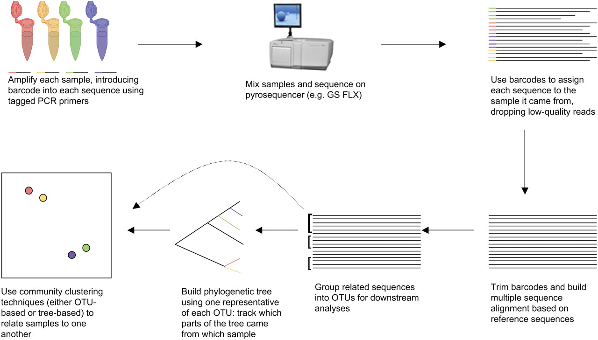
```
]

**Fig. 2**

.footnote[
[[Hamady & Knight, Genome Res. 2009](https://doi.org/10.1101/gr.085464.108)]
]
---
### Techniques: Sequencing

#### Metagenomics _vs._ 16S rRNA

|   | Metagenomics | 16s rRNA |
|------|--------------|----------|
| **Technique** | Whole-genome shotgun sequencing | Only sequence part of the 16S rRNA gene |
| **Purpose** | Measures functional potential of the whole microbiome | Sufficient to estimate which microbes are present and their abundances |
| **Organisms** | Bacteria, archaea, viruses, fungi | Bacteria & archaea only | 
| **Requirements** | Need long reads to cover genes | Short reads are sufficient |
| **Cost** | 💲💲💲 | 💲 |

---

### Techniques: Sequencing 16S rRNA gene regions

.center[
```{r, out.width='80%'}
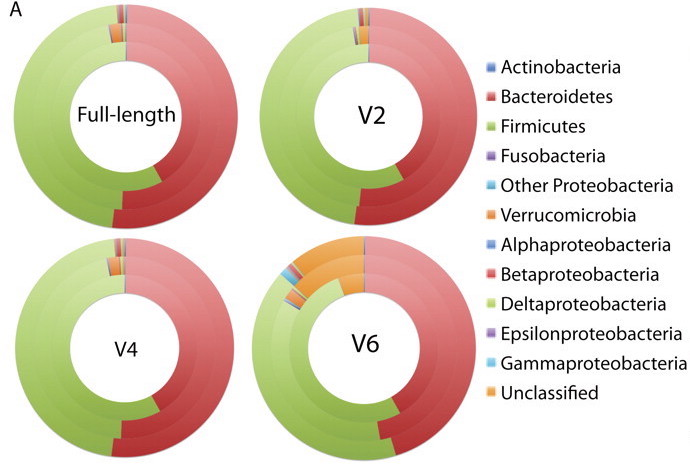
```
]

**Fig. 4 A**: V2 and V4 yield similar results to the full-length gene. V6 is not recommended due to the many unclassified sequences.
.footnote[
[[Hamady & Knight, Genome Res. 2009](https://doi.org/10.1101/gr.085464.108)]
]

---

### Techniques: Clustering OTUs

.pull-left[
```{r, out.width='60%'}
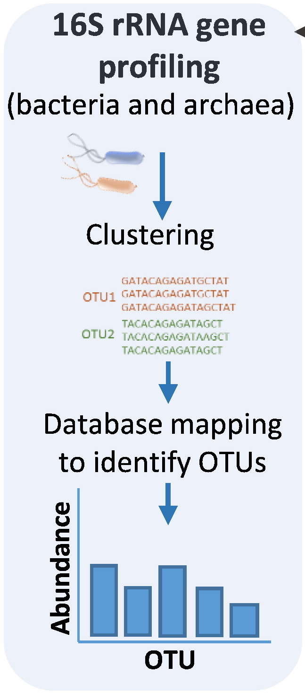
```
]

- Cluster similar 16S sequences into Operational Taxonomic Units (OTUs).
- Compare abundances of OTUs within and across samples.

.footnote[
[[Bikel et al., Comput. Struct. Biotech. 2015](10.1016/j.csbj.2015.06.001)]
]

---

### Techniques: Clustering OTUs

1. Calculate all pairwise sequence identity scores to create a distance matrix.
2. Apply cutoff of 97% sequence identity to create an adjacency matrix.
.center[
```
seqA AGGGTACG
seqB ACG-TACG
```
$$ \%\ sequence\ identity =  100 * \frac{number\ of\ matches}{sequence\  length} $$
]
.pull-left[
1) Distance matrix:

| | Seq1 | Seq2 | Seq3 |
|-|------|------|------|
| Seq1 | - | 98 | 87 |
| Seq2 | 98 | - | 76 |
| Seq3 | 87 | 76 | - |
]
.pull-right[
2) Adjacency matrix:

| | Seq1 | Seq2 | Seq3 |
|-|------|------|------|
| Seq1 | - | 1 | 0 |
| Seq2 | 1 | - | 0 |
| Seq3 | 0 | 0 | - |
]

---

### Techniques: OTU clustering algorithms

.center[
```{r, out.width='100%'}
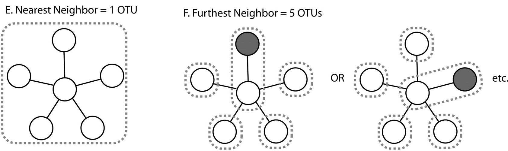
```
]

**Fig. 5 E & F**

- Nearest-neighbor: greedily add a sequence if it is similar to *any* sequence in the OTU
- Furthest-neighbor: only add a sequence if it is similar to *all* other sequences in the OTU
- Average neighbor: compromise between the two.

.footnote[
[[Hamady & Knight, Genome Res. 2009](https://doi.org/10.1101/gr.085464.108)]
[[Westcott & Schloss, PeerJ 2015](https://peerj.com/articles/1487/)]
]

---

### Techniques: Comparing communities
- Alpha diversity: how many OTUs are in a sample
- Beta diversity: how are OTUs shared among samples
- Community membership: presence/absence of OTUs
- Community structure: relative abundance of OTUs

---

### Techniques: Comparing communities

Phylum-level: relative abundance
.center[
```{r, out.width='80%'}
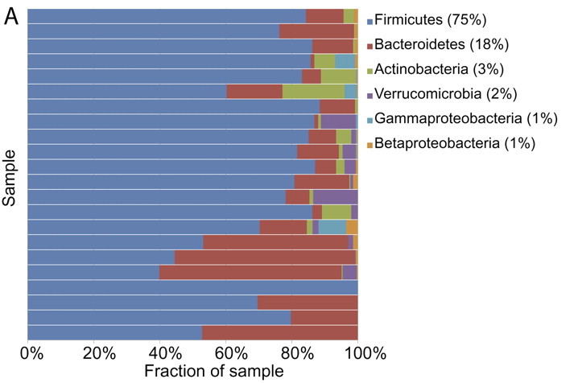
```
]

**Fig. 3**: 22 human gut samples show quite different abundances.

.footnote[
[[Hamady & Knight, Genome Res. 2009](https://doi.org/10.1101/gr.085464.108)]
]
---

### Techniques: Comparing communities
OTU-level: presence/absence of OTUs

.center[
```{r, out.width='60%'}
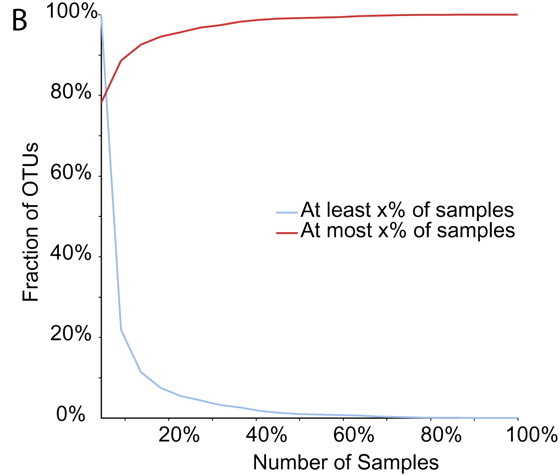
```
]

**Fig. 3**: 1813 of 2320 OTUs were present in only one sample.

.footnote[
[[Hamady & Knight, Genome Res. 2009](https://doi.org/10.1101/gr.085464.108)]
]

---

### Techniques: Comparing communities

#### Phylogenetic- vs Taxon-based analysis

.pull-left[ 
Taxon-based: assume all OTUs are equally related. 
]
.pull-right[ 
Phylogenetic: attempt to build a tree from OTUs.
]

```{r}
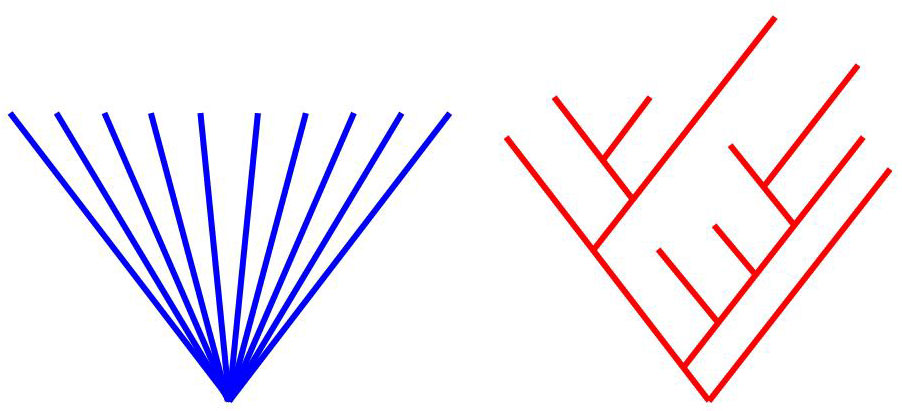
```

.footnote[
[image: [commons.wikimedia.org](https://commons.wikimedia.org/wiki/File:Phylogeny_Star_vs_Hierarchical.jpg)]
[Unifrac: [mothur.org/wiki/Unweighted_UniFrac_algorithm](https://mothur.org/wiki/Unweighted_UniFrac_algorithm)]
]

---

### Techniques: Comparing communities

Phylogenetic- vs Taxon-based analysis

.center[
```{r}
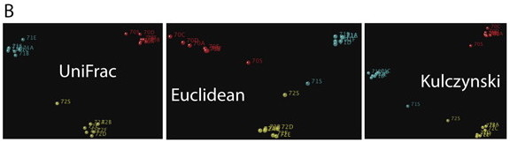
```
]

**Fig. 4B**: PCoA on full-length 16S samples. All methods give equivalent results, clustering the samples by individual.

- Unifrac (phylogenetic): distance between a pair of communities as the proportion of evolution that is unique to one community or the other.

- Euclidean & Kulcynski are taxon-based distance metrics.

.footnote[
[[Hamady & Knight, Genome Res. 2009](https://doi.org/10.1101/gr.085464.108)] [[sequentix.de/distance_measures](https://www.sequentix.de/gelquest/help/distance_measures.htm)]
]

---

### Techniques: Comparing communities

Phylogenetic methods outperform taxon-based when sequence depth is low.

```{r}
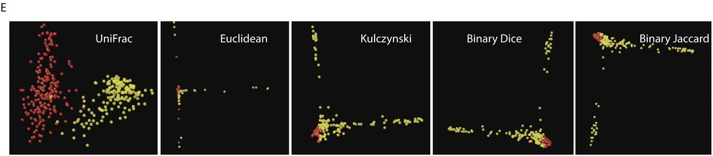
```

**Fig. 4E**: Effect of different clustering measures on (yellow) vertebrate gut and (red) free-living samples.

.pull-right[

Jaccard index: $$ \frac{|A \cap B|}{|A \cup B|} $$

]

.footnote[
[[Hamady & Knight, Genome Res. 2009](https://doi.org/10.1101/gr.085464.108)] 
[[sequentix.de/distance_measures](https://www.sequentix.de/gelquest/help/distance_measures.htm)]

]

---

## Outline

- Background
- Techniques in microbial community profiling
  - Overall Workflow
  - Sequencing
  - Clustering
  - Comparing Communities
- **Discussion**
- My Conclusions

---

## Discussion: Key Questions Addressed

- Is there a core set of microbial species or genes that all humans share?
  - Microbiomes between individuals vary greatly by which species are present and their abundances.
  - No species are shared at high abundance.
  
- How do changes in microbial abundances at particular taxonomic levels relate to health & disease?
  - Focus on gene sets, rather than taxon levels, to compare functional potential of microbiomes.

---

## Outline

- Background
- Techniques in microbial community profiling
  - Overall Workflow
  - Sequencing
  - Clustering
  - Comparing Communities
- Discussion
- **Conclusion**

---

## Conclusion

- Summarizes the techniques, best practices, and questions to consider in microbial community analysis at the time (2009).
- Although many of the tools and technologies have changed, the concepts presented here are still relevant today.

---

### Limitations

- Lacked substantial discussion of the strenghs & weakenesses of different clustering algorithms.
  - Many other algorithms besides nearest & furthest neighbor.
  - How does the quality of OTU assignments produced by different algorithms compare?
- Did not discuss limitations of phylogenetic-based comparison of communities with Unifrac.
  - Unifrac only tests whether communities have the _same_ structure; does not indicate a level of similarity.
  - Taxon-based methods do quantify a level of similarity.
- Mentions some of the tools used (e.g. Unifrac, DOTUR), but there are many gaps for a full analysis pipeline.
  
.footnote[
[[mothur.org/wiki/Unifrac.weighted](https://www.mothur.org/wiki/Unifrac.weighted)]
]

---

### Advancements since 2009

- Illumina MiSeq / HiSeq instead of 454 Pyrosequencing.
- mothur & QIIME: comprehensive tools for microbial community profiling.
- optiClust: OTU clustering algorithm in mothur.

.pull-left[
```{r, out.width='80%'}
knitr::include_graphics("figures/mothur_RGB.png")
```
]
.pull-right[
```{r}
knitr::include_graphics("figures/qiime_logo_large.png")
```
]
.footnote[
[[mothur.org/wiki](https://mothur.org/wiki)] [[riffomonas.org/minimalR](http://www.riffomonas.org/minimalR/)]
[[qiime2.org/](https://qiime2.org/)]
]

---

### Towards integrated omics
.center[
```{r, out.width='100%'}
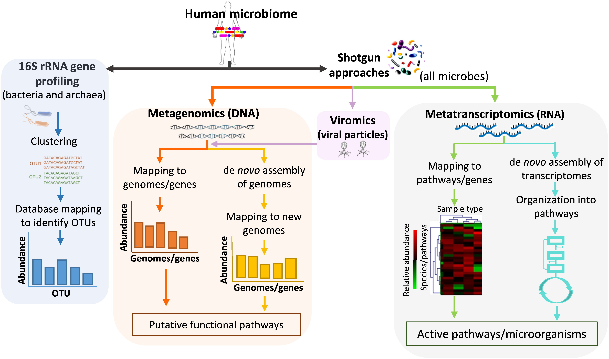
```
]
.footnote[
[[Bikel et al., Comput. Struct. Biotech. 2015](10.1016/j.csbj.2015.06.001)]
]

---

### These slides are available on GitHub: 

https://github.com/kelly-sovacool/bioinf603-fall2019 


