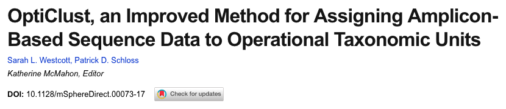

```{r setup, include=FALSE}
knitr::opts_chunk$set(echo = FALSE, eval = TRUE)
```
```{r render, eval=FALSE}
library(xaringan)
rmarkdown::render("microbiome-profiling.Rmd", output_dir = "docs/")
```

## Outline

- Background
- Techniques in microbial community profiling
- Discussion
- My Conclusions

---

### Background

**Microbiome**: The collection of microbes that live in an environment.

.center[
```{r, out.width= '80%'}

```
]

.footnote[
[1] [EMBL-EBI: What's a microbiome](https://www.ebi.ac.uk/about/news/feature-story/whats-a-microbiome)
]

---

### Background: Why care?

Changes in the composition of the human microbiome are associated with health and disease.

.center[
```{r, out.width= '80%'}
knitr::include_graphics("figures/human_microbiome.gif")
```
]

.footnote[
[2] [The Human Microbiome Project, Nature 2012](https://dx.doi.org/10.1038%2Fnature11234) [3] [theconversation.com/the-human-microbiome](http://theconversation.com/the-human-microbiome-is-a-treasure-trove-waiting-to-be-unlocked-118757)
]

---
### Background
- **Microbial community profiling**: Characterize **which microbes are present** and how **abundant** they are.

---
### Background
- **Microbial community profiling**: Characterize **which microbes are present** and how **abundant** they are.

- Application: detetecting colorectal cancer
.center[
```{r, out.width='100%'}

```
]

.footnote[
[4] [Baxter et al., Genome Med. 2016](https://genomemedicine.biomedcentral.com/articles/10.1186/s13073-016-0290-3)
]

---

### Background: Operational Taxonomic Unit (OTU)

- Proxy for microbial species at different taxonomic levels.
- Created by clustering sequences based on sequence similarity.
- Avoids difficulties of classifying bacteria into species when unknown organisms are present.

```{r, out.width='100%'}
knitr::include_graphics("figures/OTU_clustering.png")
```

---

### Background: Key Questions Raised

- Is there a core set of microbial species or genes that all humans share?

- How do changes in microbial abundances at particular taxonomic levels relate to health & disease?

---

## Outline

- Background
- **Techniques in microbial community profiling**
  - Overall Workflow
  - Sequencing
  - Clustering
  - Comparing Communities
- Discussion
- My Conclusions

---

## Techniques: Overall Workflow

.center[
```{r, out.width='100%'}

```
]
**Fig. 2**
---
### Techniques: Sequencing

#### Metagenomics _vs._ 16S rRNA

- Metagenomics
    - Whole-genome shotgun sequencing.
    - Measures functional potential of the whole microbiome.
    - Need longer reads and greater sampling depth to discover rare sequences.
    
- 16S rRNA
    - Only sequence part of the 16S rRNA gene, which is highly conserved across microbial species.
    - Useful for comparing at different taxon levels (phylum through species) becauase some regions evolve quickly while others evolve more slowly.
    - Sufficient to estimate which microbes are present at the genus level and their abundances.
    - Long reads and high sampling depth aren't necessary.

---

### Techniques: Sequencing 16S rRNA gene regions

.center[
```{r, out.width='90%'}
knitr::include_graphics("figures/F4.A.jpg")
```
]
**Fig. 4 A**: V2 and V4 yield similar results to the full-length gene. V6 is not recommended due to the many unclassified sequences.

---

### Techniques: Clustering OTUs

.pull-left[
```{r, out.width='60%'}

```
]

.pull-right[
- Cluster similar 16S sequences into Operational Taxonomic Units (OTUs).

- Compare abundances of OTUs within and across samples.
]

.footnote[
[5] [Bikel et al., Comput. Struct. Biotech. 2015](10.1016/j.csbj.2015.06.001)
]

---

### Techniques: OTU clustering algorithms


.center[
```{r, out.width='100%'}

```
]
**Fig. 5 E & F**

- Nearest-neighbor: greedily add a sequence if it is similar to *any* sequence in the OTU
- Furthest-neighbor: only add a sequence if it is similar to *all* other sequences in the OTU

[See [Westcott & Schloss, PeerJ 2015](https://peerj.com/articles/1487/) for a more recent detailed comparison of OTU clustering algorithms.]

---

### Techniques: Comparing communities

- Alpha diversity: how many OTUs are in a sample
- Beta diversity: how are OTUs shared among samples
- Community membership: presence/absence of OTUs
- Community structure: relative abundance of OTUs


.pull-left[Phylum-level] .pull-right[OTU-level (proxy for species)]


.center[
```{r, out.width='100%'}

```
]
**Fig. 3**: 22 human gut samples show quite different abundances even at the phylum level.
1813 of 2320 OTUs were present in only one sample.
---

## Outline

- Background
- Techniques in microbial community profiling
  - Overall Workflow
  - Sequencing
  - Clustering
  - Comparing Communities
- **Discussion**
- My Conclusions

---

## Discussion: Key Questions Addressed

- Is there a core set of microbial species or genes that all humans share?
  - Microbiomes between individuals vary greatly by which species are present and their abundances.
  - No species are shared at high abundance.
  
- How do changes in microbial abundances at particular taxonomic levels relate to health & disease?
  - Focus on gene sets, rather than taxon levels, to compare functional potential of microbiomes.

---

## Outline

- Background
- Techniques in microbial community profiling
  - Overall Workflow
  - Sequencing
  - Clustering
  - Comparing Communities
- Discussion
- **My Conclusions**

---

## My Conclusions

- Summarizes the techniques, best practices, and questions to consider in microbial community analysis at the time (2009).
- Although many of the tools and technologies have changed, the concepts presented here are still relevant today.

### Limitations

- Lacked substantial discussion of the strenghs & weakenesses of different clustering algorithms.
  - How does the quality of OTU assignments produced by different algorithms compare?
- Mentions some of the tools used (e.g. Unifrac, DOTUR), but there are many gaps for a full analysis pipeline.
  

---

### Advancements since 2009

- Illumina MiSeq / HiSeq instead of 454 Pyrosequencing.
- mothur & QIIME: comprehensive tools for microbial community profiling.
- optiClust: OTU clustering algorithm in mothur.

.center[
```{r, out.width='100%'}


```
]

---

### Towards integrated omics
.center[
```{r, out.width='100%'}
knitr::include_graphics("figures/multi-omics.jpg")
```
]
.footnote[
[5] [Bikel et al., Comput. Struct. Biotech. 2015](10.1016/j.csbj.2015.06.001)
]


